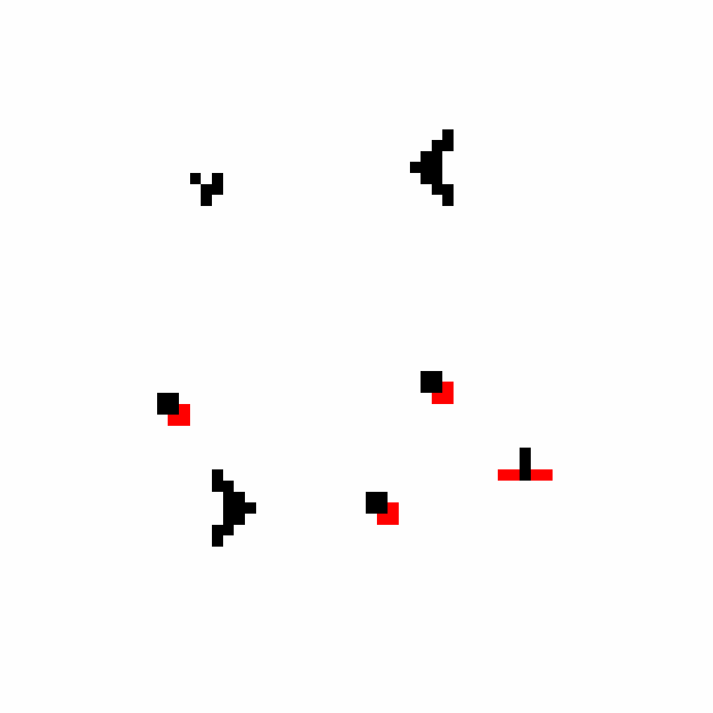

# Game_0f_l1f3
# 🧬 Game of Life с хищниками

Это реализация модифицированной "Игры жизни" на языке Python — симуляции клеточного автомата на торе (периодической плоскости), дополненной новым типом клеток — **хищниками**.

## 📚 Описание проекта

Проект решает задачу построения симуляции на поле `n x n`, где:

- Используются периодические граничные условия;
- Работают классические правила «Игры жизни» для клеток-жертв;
- Введены клетки-хищники, живущие по своим собственным правилам;
- Визуализация выполняется с помощью `matplotlib`;
- Генерируется GIF-анимация эволюции системы.

---

## ⚙️ Правила симуляции

### 🟢 Жертвы (1):
- Живут, если имеют **2–3 живых соседа**.
- Умирают от одиночества (<2) или перенаселения (>3).
- Порождаются в пустой клетке при наличии **ровно 3 соседей-жертв**.

### 🔴 Хищники (2):
- Живут, если **рядом есть хотя бы одна жертва**.
- Порождаются в пустой клетке, если рядом есть **минимум 2 хищника и 1 жертва**.
- Умирают, если рядом нет ни одной жертвы.

🎯 Симуляция заканчивается, если все клетки вымерли или прошло 50 шагов.
---
## 🔍 Пример симуляции


---

## ▶️ Как запустить

1. Установите зависимости:
```bash
pip install matplotlib imageio
